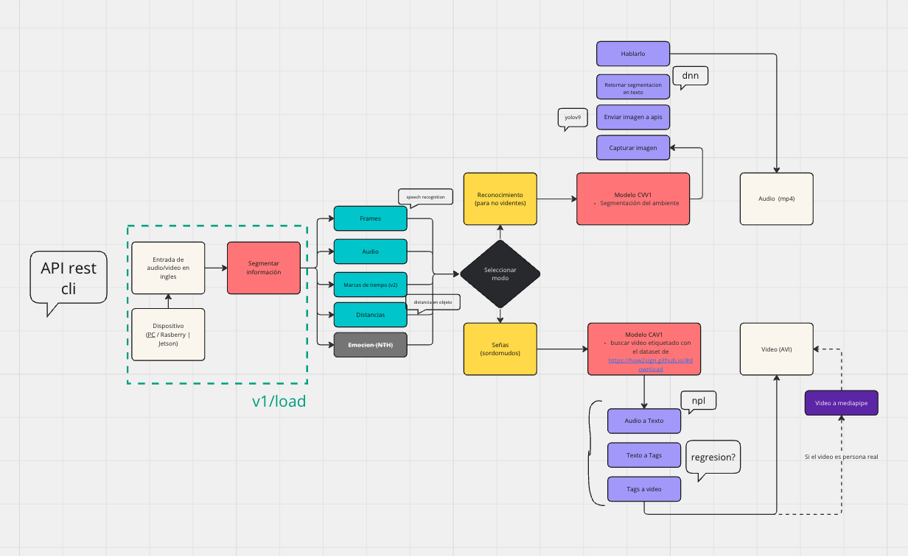

# 1. Modelo

## Flow



# 2. Configuracion

## Configuración ambientes

### Windows

### Linux

```
sudo apt-get update && apt-get upgrade
sudo apt-get install -y make build-essential libssl-dev zlib1g-dev libbz2-dev libreadline-dev libsqlite3-dev wget curl llvm libncurses5-dev libncursesw5-dev xz-utils tk-dev
```
Y se actualizan los archivos
```
curl https://pyenv.run | bash
sudo apt-get install liblzma-dev
sudo apt-get install ffmpeg
sudo apt-get instal libasound-dev portaudio19-dev libportaudio2 libportaudiocpp0
sudo apt-get build-dep hdf5
sudo apt-get pipx
```

Adicione estas lineas de codigo en los archivos `~/.profile` y `~/.bash_profile`

```
export PYENV_ROOT="$HOME/.pyenv"
[[ -d $PYENV_ROOT/bin ]] && export PATH="$PYENV_ROOT/bin:$PATH"
eval "$(pyenv init -)"
```

```
eval "$(pyenv virtualenv-init -)"
```


### Mac OS

Instale los paquetes y lance la funcion de exportar
```
/bin/bash -c "$(curl -fsSL https://raw.githubusercontent.com/Homebrew/install/HEAD/install.sh)"
export PATH="/opt/homebrew/bin:$PATH"

brew install pyenv
brew install pyenv-virtualenv
brew install ffmpeg
brew install hdf5
brew install portaudio 
```

Adicione estas lineas de codigo en los archivos `~/.bash_profile` y `~/.bashrc`

```
# Brew
export PATH="/opt/homebrew/bin:$PATH"

# PyEnv
export PATH="$HOME/.pyenv/bin:$PATH"
eval "$(pyenv init --path)"
eval "$(pyenv init -)"
eval "$(pyenv virtualenv-init -)"
```

Reinicie la configuracion de perfil de bash
> ```
> source ~/.bash_profile 
> source ~/.bashrc
> ```


## Configurar virtual envs
Instale la version de python con `pyenv`
> ```
> pyenv install --list
> pyenv install 3.11.0
> ```

Ubique el directorio de trabajo y corra los siguientes comandos
> ```
> pyenv local 3.11.0
> pyenv virtualenv
> pyenv virtualenv 3.11.0 .ia_venv
> ```

Donde `.ia_venv` es el nombre del folder de nuestro entorno virtual local
> ```
> pyenv local .ia_venv 
> python --version
> which python
> ```

## Activar virtual envs
Para activar el ambiente virtual hagalo ingresando al proyecto y vera en el shell `(.ia_venv)` o si no ejecute la ruta completa
> ```
> cd project
> source /Users/joseph.diaz/.pyenv/versions/3.11.0/envs/.ia_venv/bin/activate
> ```

## Instalacion paquetes
Para instalar los paquetes necesarios ejecute

> ```
> pip3 install --upgrade pip
> pip3 install -r requirements.txt
> ```
y puede validar que todos los paquetes quedaran instalados dando `pip3 freeze` o `pip3 list`


Si tiene problemas con los paquetes puede validar usando la opcion de `pipx`
> ```
> pipx install nltk
> pipx install scikit-learn
> pipx install gensim
> ```

# 3. Lanzar proyecto
Para lanzar el proyecto se cuenta con las opciones de `api` y de `cli`

## 1. Levante el servicio API
Con api tendras la posiblidad de cargar un video a traves los siguientes pasos:
Levante el ambiente a traves de servicios api rest de fastapi con el comando
> ```
> uvicorn project.adapters.rest:app --host 0.0.0.0 --port 8000 --reload
> ```

Y ejecute todo el contenido desde [http://localhost:8000/docs](http://localhost:8000/docs) 

**Correr modelo apoyo personas con idioma de señas**
- `POST /v1/run/models/hamodel`
- `GET /v1/run/models/hamodel`

**Correr modelo apoyo personas con discapacidad visual**
- `POST /v1/run/models/vsmodel`
- `GET /v1/run/models/vsmodel`

## 2. Comparativa api vs cli

### Modelo HAModel

**CLI**

Validar modelo hamodel desde una oracion
> ```
> PYTHONPATH=. python3 project/adapters/cli/v1/__init__.py --model hamodel --sentences 'sentences'
> ```

Validar modelo hamodel desde un video
> ```
> PYTHONPATH=. python3 project/adapters/cli/v1/__init__.py --model hamodel --sentences 'sentences' --path 'video.mp4'
> ```

Validar modelo hamodel desde una entrada de audio
> ```
> PYTHONPATH=. python3 project/adapters/cli/v1/__init__.py --model hamodel --audio True
> ```
Ejemplos de frases y respuestas
* _fqEO3MuTlEE_15-5-rgb_front	87.94	88.72	Oh!_
* _fqEO3MuTlEE_16-5-rgb_front	88.73	91.52	That's a little bit more than a little bit._
* _fqEO3MuTlEE_17-5-rgb_front	92.4	95.79	Give it a straw and bottoms up!_
* _fqEO3MuTlEE_2-5-rgb_front	13.47	20.84	Find that real quick, here we go._
* _fqEO3MuTlEE_3-5-rgb_front	21.76	24.89	And, also, one shot of dark rum._
* _fqEO3MuTlEE_4-5-rgb_front	25.54	26.84	Here we go._
* _fqEO3MuTlEE_5-5-rgb_front	27.43	30.18	And, some lime juice._
* _fqEO3MuTlEE_6-5-rgb_front	36.64	41.76	About a teaspoon of lime juice._
* _fqEO3MuTlEE_7-5-rgb_front	42.03	48.12	Next we're going to add pineapple juice and orange juice._
* _fqEO3MuTlEE_8-5-rgb_front	48.81	52.62	There's orange juice and pineapple juice._
* _fqEO3MuTlEE_9-5-rgb_front	52.7	54.31	Equal parts of both._
* _fsfTrRxuJ-c_0-5-rgb_front	0.84	1.26	Hi!_


Testear modelo hamodel con datos prueba
> ```
> PYTHONPATH=. python3 project/adapters/cli/v1/__init__.py --model hamodel --test_audio True
> ```


**REST**

Validar modelo hamodel desde una oracion
> ```
> curl -X 'POST' \
> 'http://127.0.0.1:8000/v1/run/models/hamodel?sentences=sentences' \
> -H 'accept: application/json' \
> -H 'Content-Type: multipart/form-data' \
> -F 'file='
> ```


Validar modelo hamodel desde un video
> ```
> curl -X 'POST' \
>  'http://127.0.0.1:8000/v1/run/models/hamodel?sentences=sentences' \
>  -H 'accept: application/json' \
>  -H 'Content-Type: multipart/form-data' \
>  -F 'file=@video.mp4;type=video/mp4'
> ```


### Modelo VSModel

**CLI**

Validar modelo vsmodel desde la camara
> ```
> PYTHONPATH=. python3 project/adapters/cli/v1/__init__.py --model vsmodel --cam True
> ```

# 3. Docker

> ```
> docker-compose -f dockercompose.yml up --build
> ```

# TODOs

* 😭 Validar lectura de audio sobre rasberry
* 😭 Publicar api en AWS y consumir recursos de S3
* 😭 Entregar dominio a profe y con certificados
* 😍 Ajustar respuestas de api para que devuelva las rutas de los video con boto3 S3
