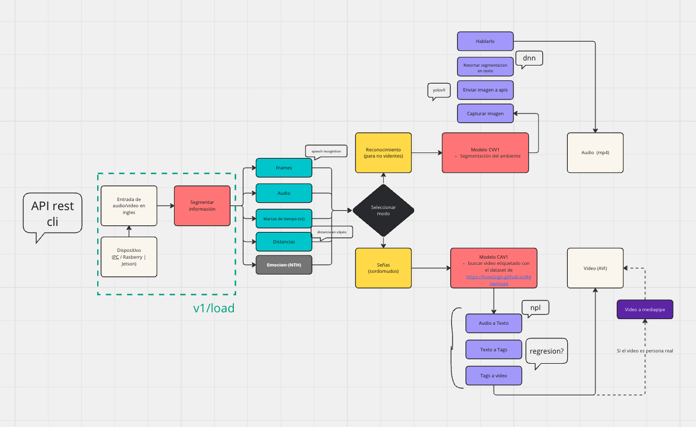

# RUN

# Virtual envs
## Packages mac
brew install ffmpeg

## Activar virtual envs
```source /Users/joseph.diaz/.pyenv/versions/3.9.6/envs/.venv/bin/activate```

# Flow


# Entrypoints
## api

```uvicorn project.adapters.rest:app --host 0.0.0.0 --port 8000 --reload ```
POST /v1/load
POST /v1/training/cvv1
POST /v1/training/cav1


## cli